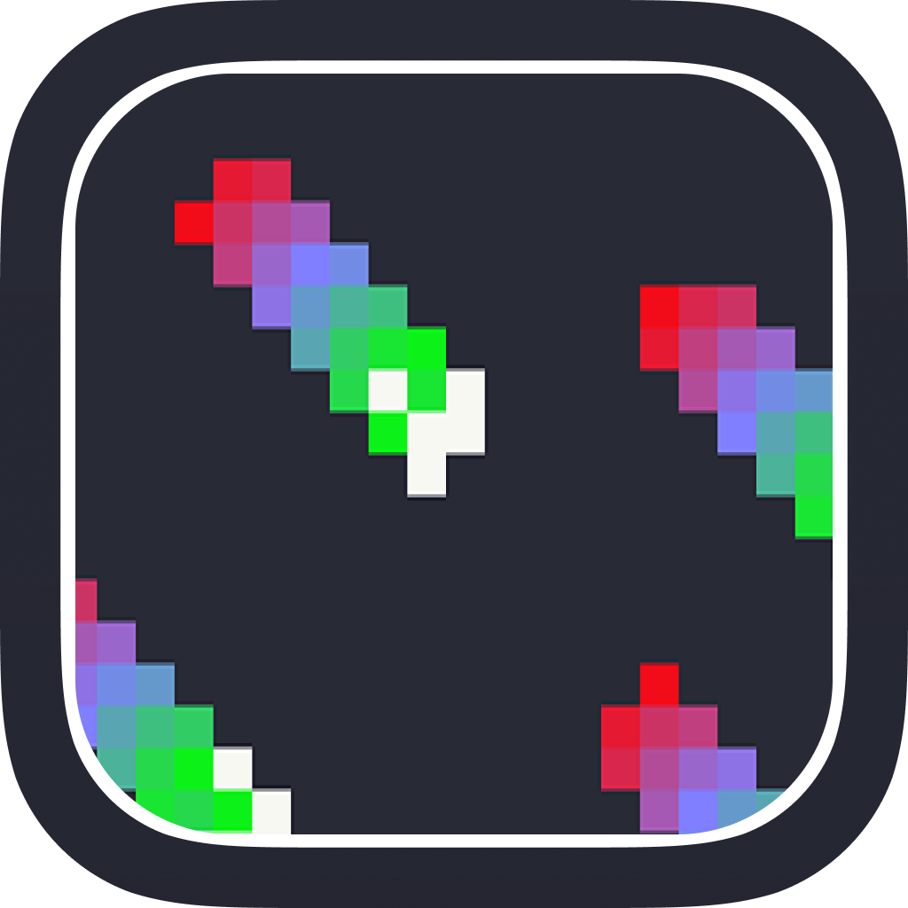
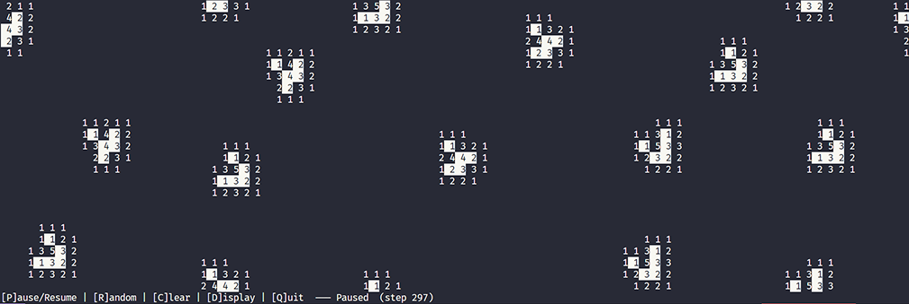
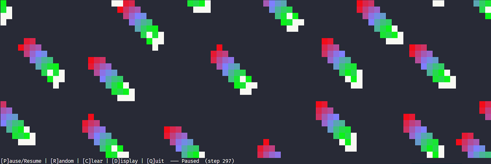
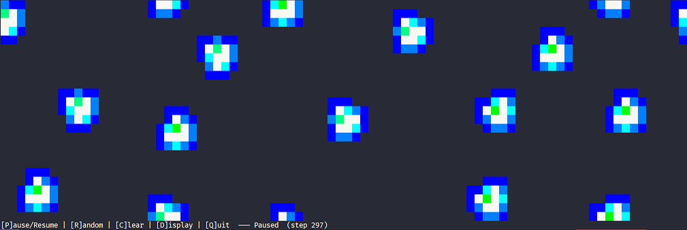
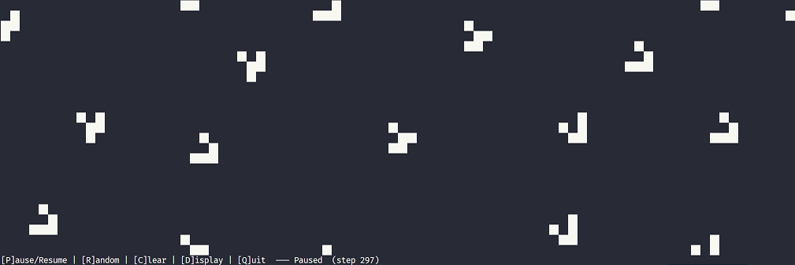
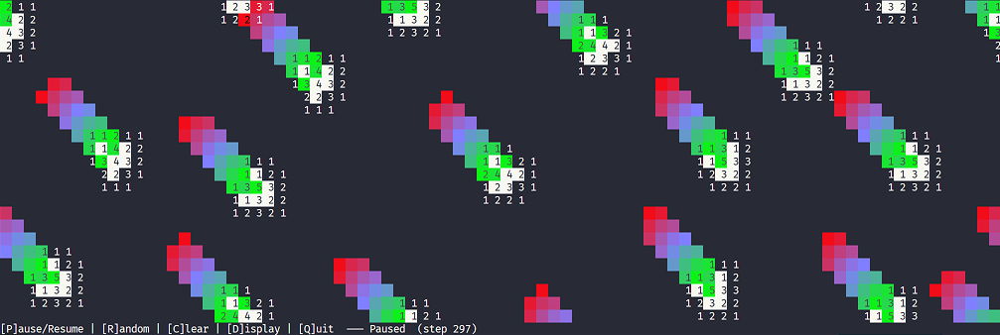

<p align="center">
  
</p>

<h1 align="center">Game of Life</h1>

<p align="center">
  <strong>Conway's game of life in Rust in the terminal.</strong>
</p>

<p align="center">
  
  
  
</p>

## Screenshots

| Neighbours | Trail | Heatmap |
| :---: | :---: | :---: |
|  |  |  |

| Default | Trail & Neighbours |
| :---: | :---: |
|  |  |

## Features

- [x] Mouse click to draw cells
- [x] Neighbour count visualization
- [x] Heatmap visualization
- [x] Trail visualization
- [x] Original view
- [x] Simulation control (Pause/Play/Restart/Clear)

## Usage

1. **Clone the repository**

    ```bash
    git clone https://github.com/reddcarp/game-of-life-term.git
    ```

2. **Build binary**

    ```bash
    cd game-of-life-term
    cargo build --release
    ```

3. **Run binary**

    ```bash
    ./target/release/game_of_life
    ```
